# System Architecture

> Architecture diagrams and component documentation for Agent Guardrails Template

**Version:** 1.0
**Last Updated:** 2026-02-15

---

## Table of Contents

1. [High-Level Architecture](#high-level-architecture)
2. [Component Diagram](#component-diagram)
3. [Data Flow](#data-flow)
4. [Team Structure](#team-structure)
5. [Deployment Architecture](#deployment-architecture)
6. [Integration Points](#integration-points)

---

## High-Level Architecture

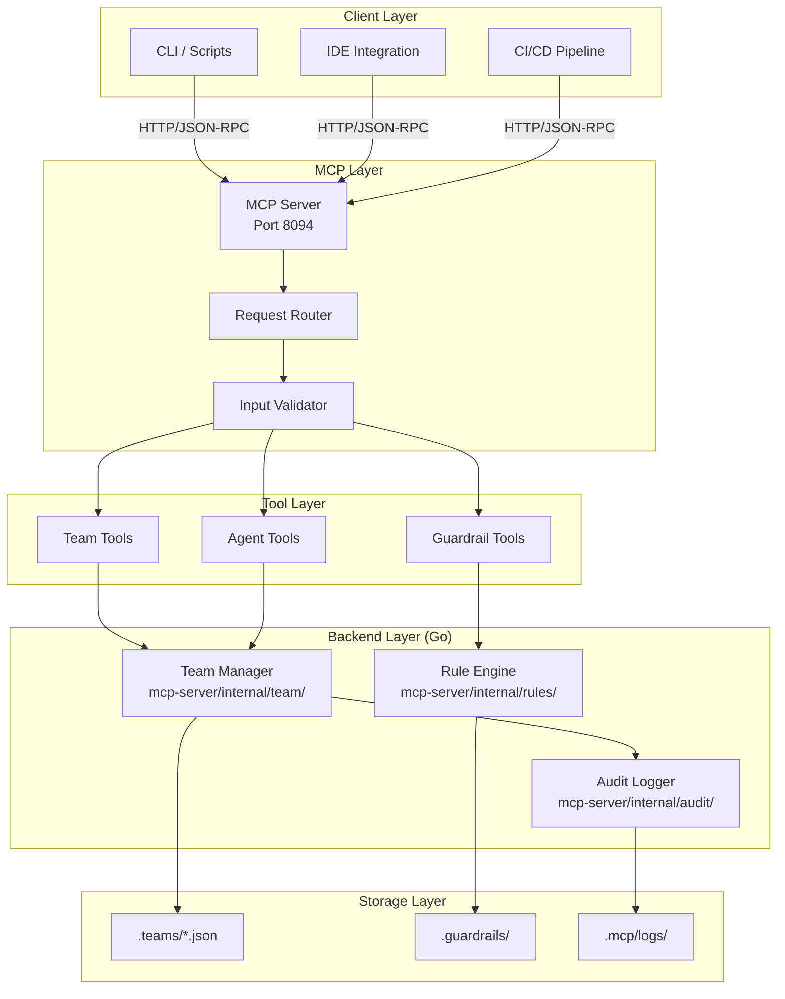

### Architecture Overview

The Agent Guardrails Template follows a layered architecture with clear separation of concerns:

> **Go Implementation:** All backend services are implemented in Go (v2.6.0+). See `mcp-server/internal/`.

| Layer | Responsibility | Components |
|-------|---------------|------------|
| Client | Interface with users | CLI, IDE, CI/CD |
| MCP | Protocol handling | Server, routing, validation |
| Tools | Business logic | Team, guardrail, agent operations |
| Backend | Core services (Go) | Team manager, rules engine, audit logger |
| Storage | Persistence | PostgreSQL, Redis, JSON configs |

---

## Component Diagram

### MCP Server Components

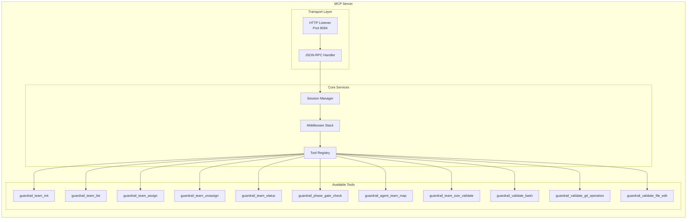

### Team Manager Components

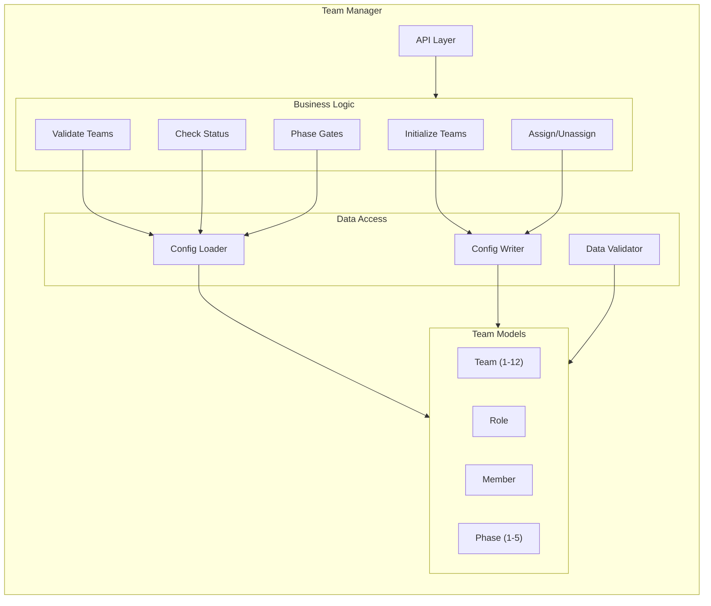

---

## Data Flow

### Tool Execution Flow

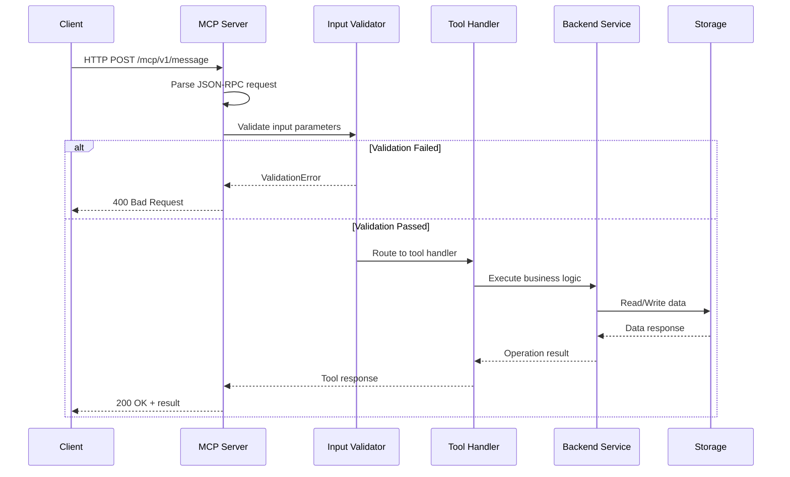

### Team Assignment Flow

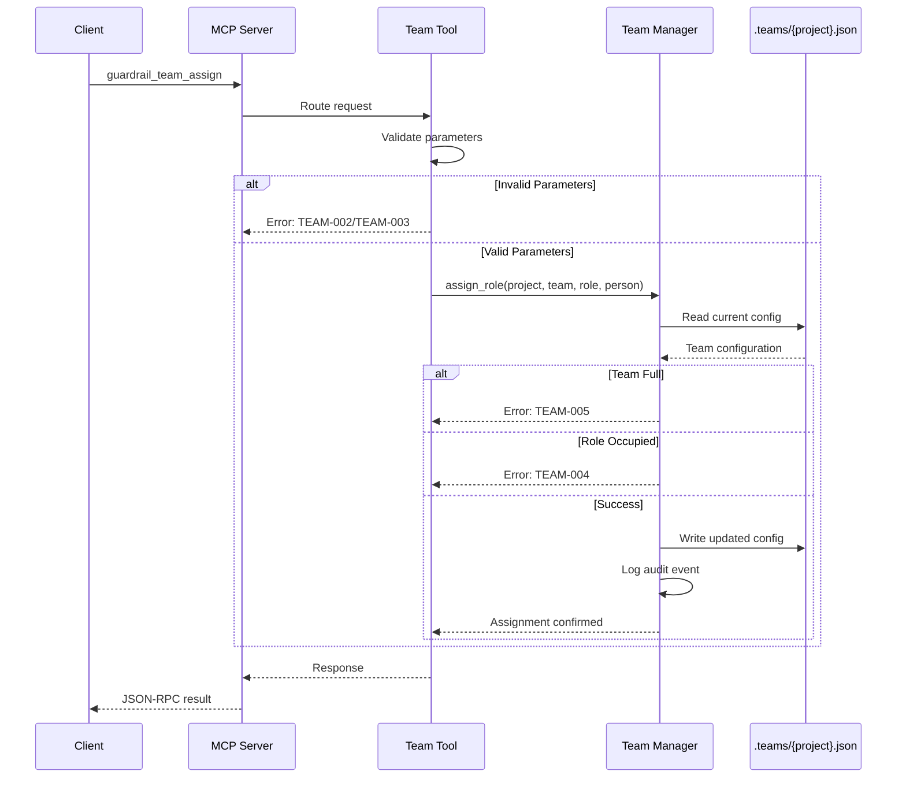

### Phase Gate Check Flow

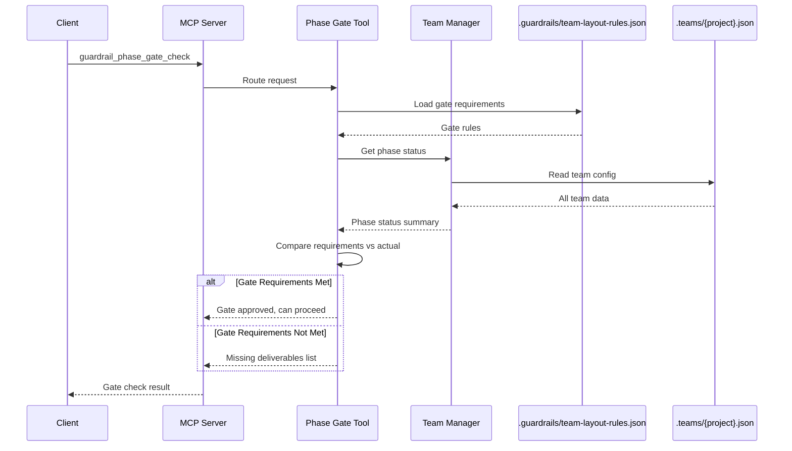

---

## Team Structure

### 12-Team Organization

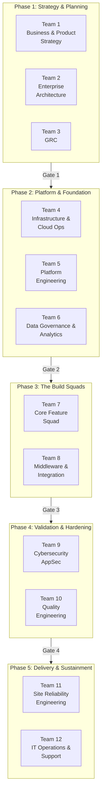

### Phase Gate Flow

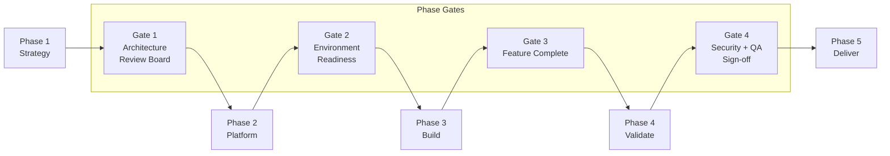

---

## Deployment Architecture

### Single Node Deployment

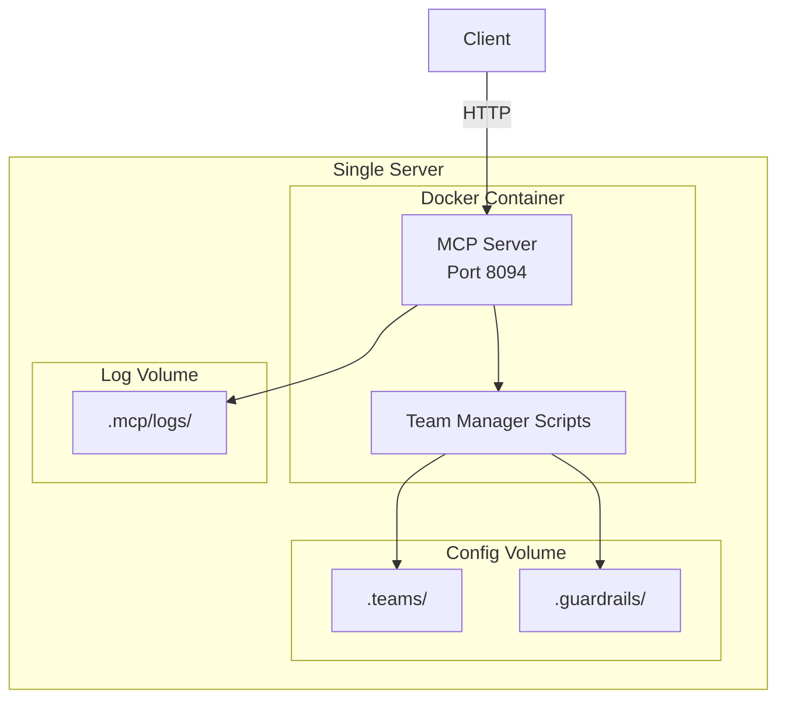

### Production Deployment

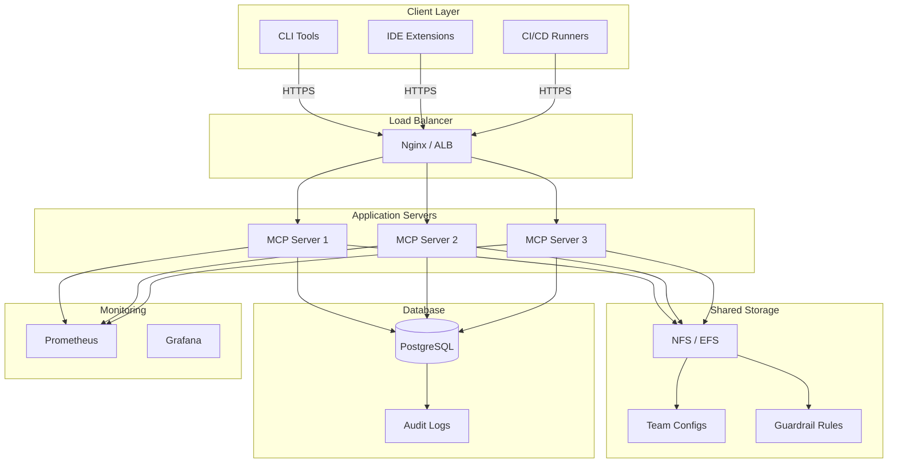

---

## Integration Points

### External System Integrations

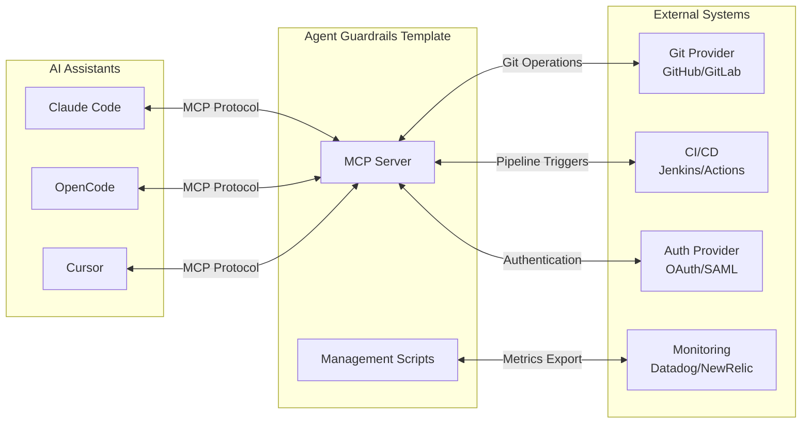

### API Integration Patterns

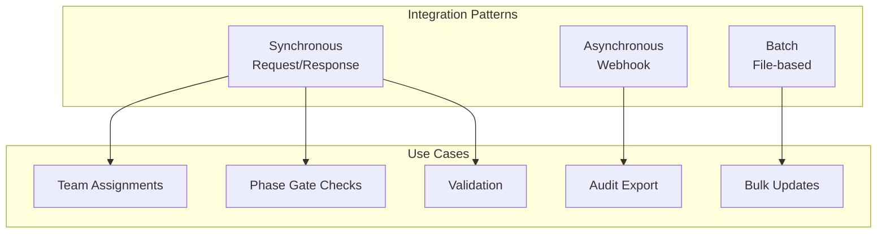

---

## Security Architecture

### Authentication Flow

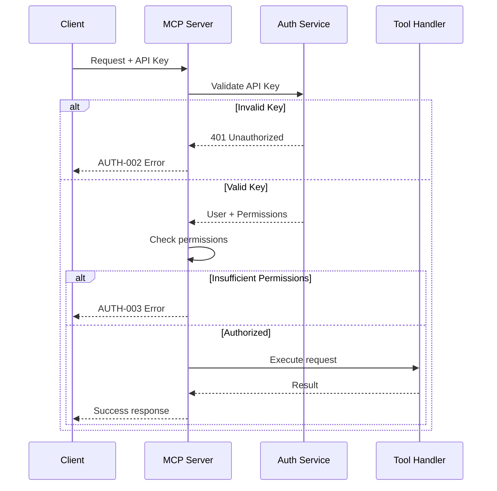

### Data Protection

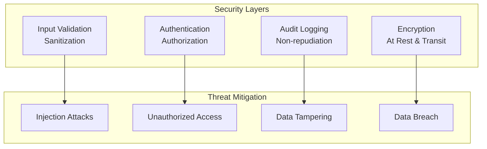

---

## Configuration Architecture

> **Go Implementation:** All backend logic is implemented in Go. See `mcp-server/internal/` for package structure.
> **Migration:** `team_manager.py` has been migrated to Go (v2.6.0). See [PYTHON_MIGRATION.md](PYTHON_MIGRATION.md).

### File Organization

```
/mnt/ollama/git/agent-guardrails-template/
├── mcp-server/
│   ├── internal/                    # Go implementation
│   │   ├── team/                    # Team management logic
│   │   ├── rules/                   # Rule engine
│   │   ├── audit/                   # Audit logging
│   │   ├── database/                # Database operations
│   │   ├── cache/                   # Redis caching
│   │   ├── mcp/                     # MCP protocol
│   │   └── web/                     # HTTP handlers
│   └── cmd/server/                  # Main entry point
├── .teams/
│   ├── {project-name}.json          # Team configurations
│   └── backups/
│       └── *.json.bak               # Automatic backups
├── .guardrails/
│   ├── rules.json                   # Validation rules
│   ├── team-layout-rules.json       # Team structure rules
│   └── schemas/
│       └── team-config.schema.json  # JSON Schema
├── .mcp/
│   ├── mcp.log                      # Server logs
│   ├── audit.log                    # Security audit logs
│   └── config.json                  # Server configuration
└── scripts/
    └── setup_agents.py              # Agent setup (Python - legacy)
```

---

**Last Updated:** 2026-02-15
**Version:** 2.6.0
**Implementation:** Go (mcp-server/internal/)
