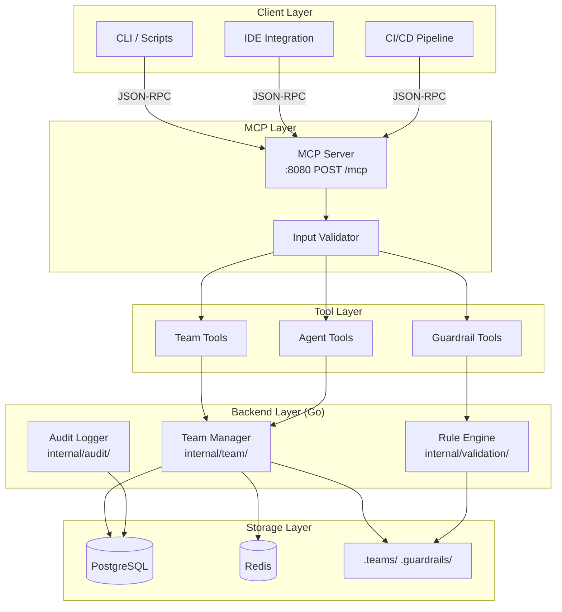
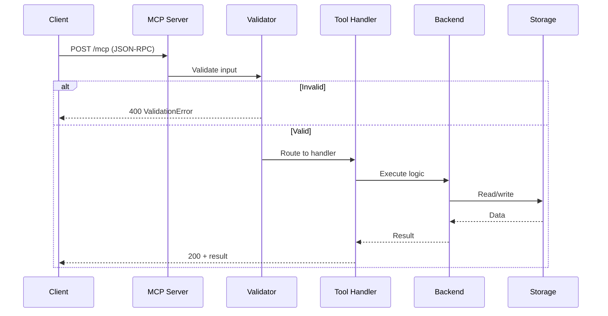
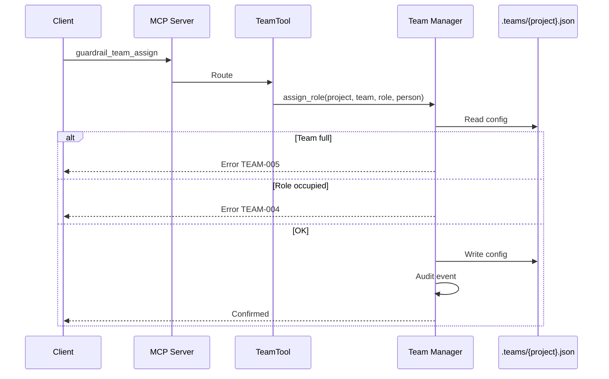
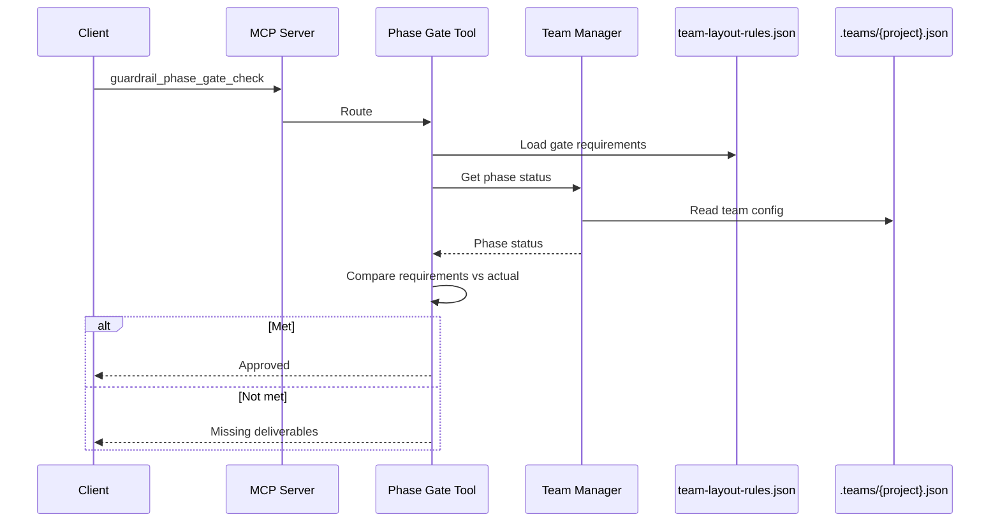
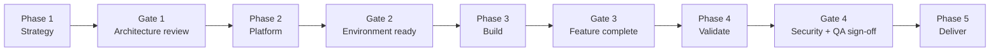
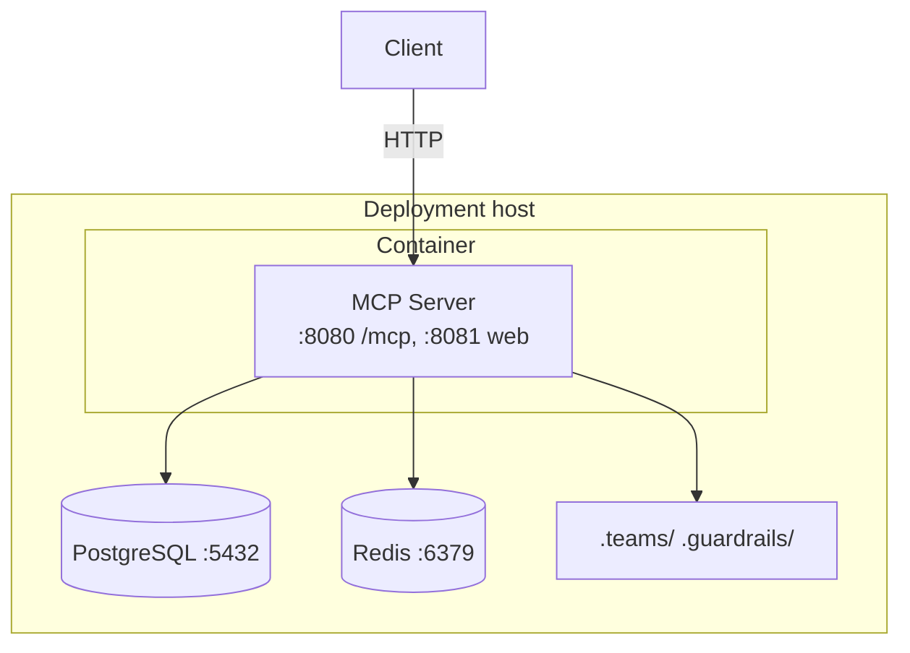
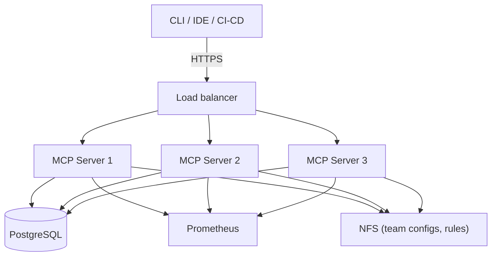
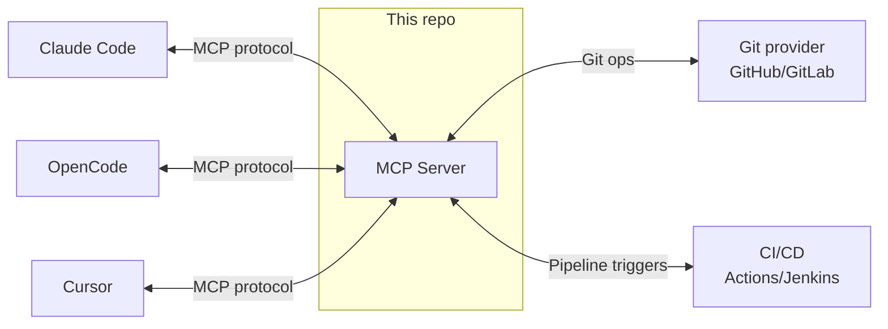
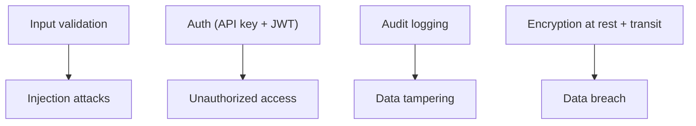

# System Architecture

How the Agent Guardrails Template fits together — the layers, data flow, and
deployment topology. All backend services are Go (`mcp-server/internal/`).

## High-level architecture



| Layer | Responsibility | Components |
|-------|---------------|------------|
| Client | User interface | CLI, IDE extensions, CI/CD |
| MCP | Protocol handling | Stateless StreamableHTTP server, validation |
| Tools | Business logic | Team, guardrail, agent operations (35 tools) |
| Backend | Core services | Team manager, rule engine, audit logger |
| Storage | Persistence | PostgreSQL, Redis, JSON configs |

## Transport

As of v3.3.0 the server speaks **stateless StreamableHTTP**: a single
`POST /mcp` endpoint, no session IDs, each request independent. This replaces
the old SSE two-step flow and makes the server trivial to run behind a load
balancer. The web UI and REST API run on a separate port (`:8081`).

## Data flow

### Tool execution



### Team assignment



### Phase gate check



## Team structure

Teams are organized into 5 phases of the delivery lifecycle, each with a gate
before the next phase begins:



| Phase | Teams | Focus |
|-------|-------|-------|
| 1 — Strategy | Business & Product Strategy, Enterprise Architecture, GRC | Planning |
| 2 — Platform | Infrastructure, Platform Engineering, Data Governance | Foundation |
| 3 — Build | Core Feature Squad, Middleware & Integration | Implementation |
| 4 — Validate | Cybersecurity/AppSec, Quality Engineering | Hardening |
| 5 — Deliver | SRE, IT Operations & Support | Sustainment |

See [team-structure.md](../teams/team-structure.md) for role definitions and
[team-tools.md](../teams/team-tools.md) for the MCP tools that manage this.

## Deployment

### Single node



By default ports bind to `127.0.0.1` via `BIND_ADDR`. Set `BIND_ADDR` to expose
on another interface (e.g. a tailnet IP). See the
[deployment guide](../../mcp-server/deployment-guide.md).

### Production (scaled)



Stateless transport means any server can serve any request — no sticky sessions.

## Integration points



| Pattern | Use for |
|---------|---------|
| Synchronous request/response | Team assignments, phase gates, validation |
| Asynchronous webhook | Violation/halt notifications, audit export |
| Batch / file-based | Bulk rule updates |

## Security



- **API key auth** on write/IDE endpoints; read-only web routes public.
- **JWT** session tokens for MCP clients, 15-min expiry, rotation configurable.
- **Secrets scanning** of document content (AWS keys, GitHub tokens, private keys, etc.).
- **Rate limiting** per API key (MCP 1000/min, IDE 500/min).
- Parameterized queries, regex timeouts (ReDoS protection), strict CSP headers.

See [security audits](../security/) for the detailed reviews.

## Configuration layout

```
agent-guardrails-template/
├── mcp-server/
│   ├── internal/           # Go: team, validation, audit, database, cache, mcp, web
│   └── cmd/server/         # entry point
├── .teams/                 # team configurations (per-project JSON)
├── .guardrails/            # rules, team-layout-rules, schemas
├── pi-extension/           # TypeScript extension for the pi agent
└── docs/                   # this documentation
```

The server reads `.env` for secrets (never committed). See
[python-to-go-migration.md](../mcp-server/python-to-go-migration.md) for the
history of the backend (Python team manager retired in v2.6.0).
